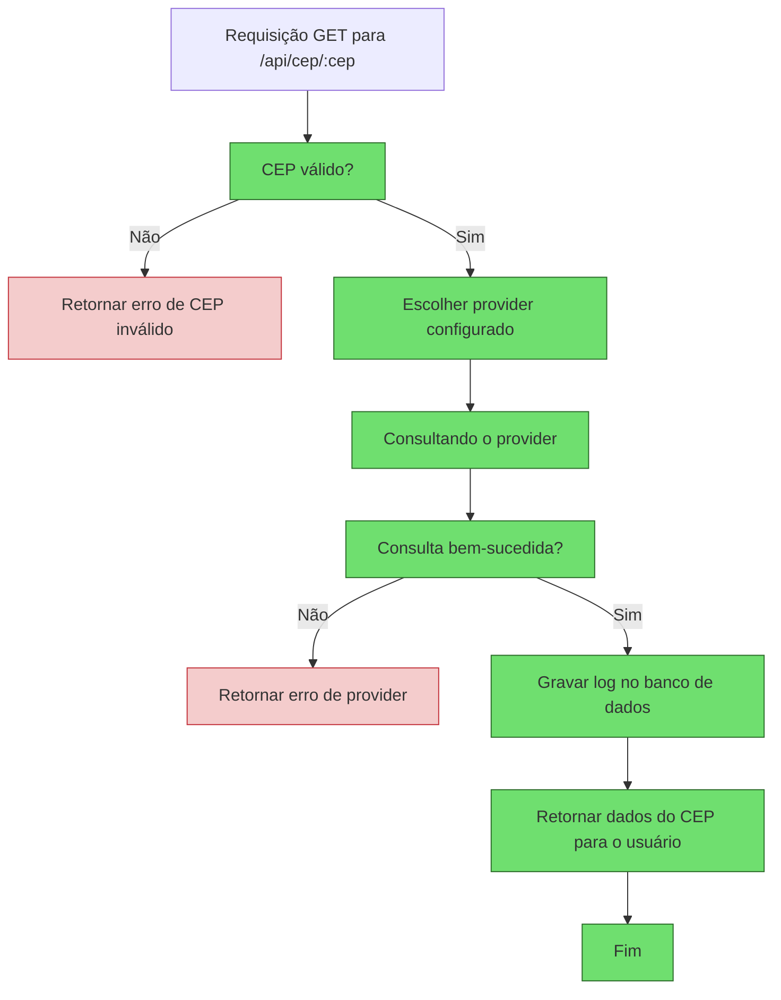
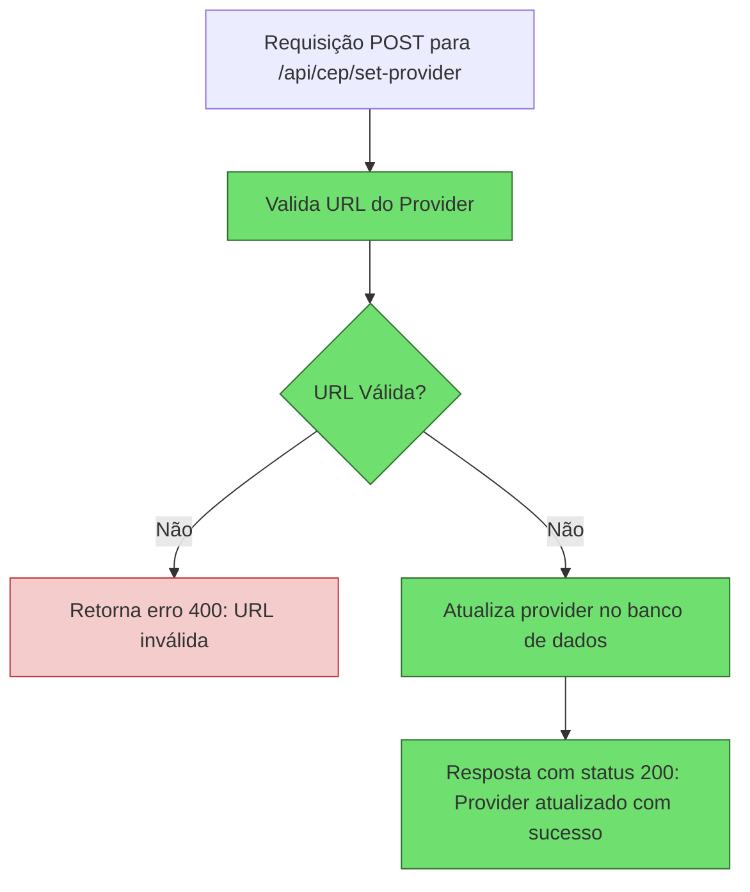
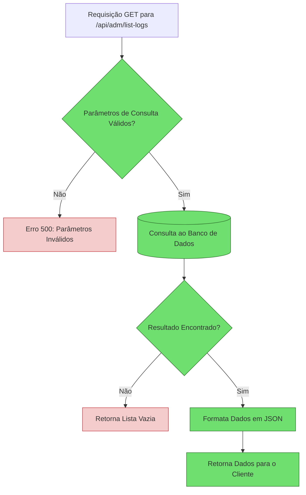

# Sumário

1. [Consulta CEP API](#consulta-cep-api)
   - [Funcionalidades](#funcionalidades)
   - [Tecnologias Utilizadas](#tecnologias-utilizadas)
   - [Como Usar](#como-usar)
   - [Banco de Dados](#banco-de-dados)
   - [Docker Compose](#docker-compose)

2. [Design da Solução](#design-da-solução)
   - [Diagrama](#diagrama)
        - [Diagrama da Consulta de CEP](#diagrama-da-consulta-de-cep)
        - [Diagrama para Alterar Provider](#diagrama-para-alterar-provider)
        - [Diagrama Histórico de Consulta](#diagrama-histórico-de-consulta)
   - [Arquitetura](#arquitetura)
   - [Fluxo de Execução](#fluxo-de-execução)
   - [Padrões de Design Adotados](#padrões-de-design-adotados)

3. [Aplicação dos Princípios SOLID](#aplicação-dos-princípios-solid)

4. [Dependências](#dependências)

5. [Como Contribuir](#como-contribuir)

6. [Referências](#referências)


---

# Consulta CEP API

Esta aplicação fornece uma API que permite consultar informações de CEP a partir de um provider configurável. O provider pode ser alterado dinamicamente, com suporte para mocks (Mockoon, WireMock) ou APIs externas.

A aplicação também grava logs de todas as consultas realizadas, incluindo o horário da consulta e os dados retornados.

---

## Funcionalidades

- **Consulta CEP**: Realiza a consulta de um CEP, retornando as informações de endereço.
- **Alteração Dinâmica do Provider**: Permite trocar o provider utilizado para consulta (por exemplo, Mockoon, - WireMock, ou APIs externas reais).
- **Logs de Consultas**: Registra todas as consultas realizadas no banco de dados.
- **Histórico de Consultas**: Retornar as consultas realizadas.
- **Validação de CEP**: Valida se o CEP informado está correto (apenas números).
- **Swagger**: Documentação interativa da API disponível via Swagger UI.

---

## Tecnologias Utilizadas

- **Spring Boot**: Framework para desenvolvimento da aplicação.
- **RestTemplate**: Cliente HTTP para realizar as requisições para os providers.
- **JPA (Spring Data)**: Para gravação de logs de consulta no banco de dados.
- **PostgreSQL**: Banco de dados para armazenamento dos logs de consultas.
- **Swagger**: Para documentação da API.
- **Docker**: Para criar os containers do banco de dados e mocks.
---

## Como Usar

1. Inicializando a Aplicação
Para rodar a aplicação, basta executar o comando:

    ```bash
    mvn spring-boot:run
    ```

    Ou, caso prefira rodar a aplicação como um arquivo JAR:

    ```bash
    mvn clean package
    java -jar target/consulta-cep-api.jar
    ```

2. Alterando o Provider

    Você pode alterar o provider utilizado para consulta via um endpoint específico. A aplicação suporta Mockoon, WireMock ou qualquer API externa configurada.

    Para mudar o provider, faça uma requisição POST para o seguinte endpoint:

    ```http
    POST /api/cep/set-provider?providerUrl={url_do_provider}
    ```

    Exemplo:

    ```http
    POST /api/cep/set-provider?providerUrl=http://localhost:3000/api
    ```

    Onde providerUrl é a URL do provider desejado, as opções disponíveis no momento são: **mockoon** e **publicapi**.

3. Consultando um CEP
    Para consultar um CEP, faça uma requisição GET para o seguinte endpoint:

    ```http
    GET /api/cep/{cep}
    ```

    Exemplo:


    ```http
    GET /api/cep/01001000
    ```

4. Swagger
    A documentação interativa da API está disponível em:

    ```bash
    http://localhost:8080/swagger-ui.html
    ```

    Estrutura de Dados
    Resposta da Consulta ao CEP

    ```json
    {
        "cep": "string",
        "logradouro": "string",
        "bairro": "string",
        "cidade": "string",
        "estado": "string",
        "fonte": "string"
    }
    ```

---


## Banco de Dados
A aplicação utiliza o PostgreSQL para armazenar os logs de consulta ao CEP, com as seguintes informações:

- **CEP** consultado.
- **Provider** usado para a consulta.
- **Dados retornados** pela consulta.
- **Horário da consulta**.

## Docker Compose

Para facilitar a configuração do PostgreSQL e outros serviços necessários, a aplicação usa **Docker Compose**.

O arquivo ``docker-compose.yml`` contém a configuração para rodar o PostgreSQL e o Mockoon em um container Docker. Para iniciar o ambiente com Docker Compose, execute o seguinte comando:

```bash
docker-compose up -d
```

Isso vai iniciar o PostgreSQL no container, e você pode acessar o banco de dados na URL ``jdbc:postgresql://localhost:5432/cep_logs``.


---

# Design da Solução


---

## Diagrama

Para melhor experiência veremos os 3 comportamentos que esperamos que aconteça para a nossa aplicação.
Sendo o primeiro, o comportamento proposto como desafio, e os demais diagramas como complemento para melhor experiência para a solução proposta.


---

### Diagrama da Consulta de CEP



**Explicação do fluxo**:
- **Início da requisição**: O usuário envia uma requisição para consultar o CEP.
- **Validação do CEP**: Verifica se o CEP contém apenas números. Se não, um erro é retornado.
- **Escolha do provider**: A aplicação seleciona qual provider usar para realizar a consulta (Mockoon, WireMock ou API externa).
- **Consulta ao provider**: A aplicação faz a requisição ao provider configurado via RestTemplate.
- **Consulta bem-sucedida?**: Verifica se a consulta ao provider foi bem-sucedida. Se falhar, um erro é retornado.
- **Gravação no banco de dados**: Após a consulta, os dados (CEP, provider, dados retornados e timestamp) são salvos no banco de dados.
- **Resposta ao usuário**: A aplicação retorna os dados do CEP consultado ao usuário.


---

### Diagrama para Alterar Provider




**Explicação do Fluxo**:

- **Requisição POST**: O fluxo começa quando uma requisição POST é feita para o endpoint ``/api/cep/set-provider``. O cliente envia a URL do provider como parâmetro na query string (por exemplo, ``?providerUrl=mockoon`` ou ``?providerUrl=publicapi``).

- **Validação da URL**: A aplicação valida se a URL fornecida é válida. Isso inclui verificar se o formato da URL está correto e se é uma URL que pode ser acessada para realizar consultas de CEP.

- **Verificação de URL válida**: O sistema verifica se a URL fornecida é válida.

Se a URL for inválida, a aplicação retorna um erro 400 com a mensagem: "URL inválida".
Se a URL for válida, a aplicação procede para o próximo passo.
- **Atualização do Provider**: Caso a URL seja válida, a aplicação atualiza o provider configurado. Isso envolve armazenar a URL fornecida no banco de dados ou em uma configuração centralizada da aplicação, garantindo que futuras consultas ao CEP usem esse novo provider.

- **Resposta de Sucesso**: Após a atualização bem-sucedida, o sistema responde com um status 200 e a mensagem "Provider atualizado com sucesso", indicando que a alteração foi realizada com sucesso.


---

### Diagrama Histórico de Consulta



**Explicação do Fluxo do Endpoint de Histórico de Consulta**

- **Início**: O endpoint é acionado quando o usuário faz uma solicitação de consulta ao histórico.
- **Validação dos Parâmetros de Consulta**:
    - Os parâmetros fornecidos na solicitação (como size e page são números) são validados.
    - Se inválidos: o sistema retorna um erro 500: Parâmetros Inválidos.
    - **Obs.**: Lógica para validação customizada não implementada.

- **Consulta ao Banco de Dados**: Uma consulta SQL é executada no banco de dados para buscar os dados do histórico com base nos parâmetros fornecidos.
- **Verificação dos Resultados da Consulta**: 
    - O sistema verifica se há registros correspondentes.
    - Se nenhum registro for encontrado: retorna uma lista vazia para o cliente.
- **Formatação da Resposta**: Os dados recuperados são organizados e formatados no formato JSON para facilitar a leitura pelo cliente.

- **Retorno ao Cliente**: A resposta final, contendo os dados ou uma lista vazia, é enviada de volta ao cliente.

<!--
    TODO: LÓGICA DESEJADA POR SER IMPLEMENTADA

(Para o mermeid "funcionar" tirar o espaço entre "-- e >")

```mermaid
    flowchart TD
        Inicio([Início]) -- > VerificaAutenticacao{Usuário Autenticado?}
        VerificaAutenticacao -- Não -- > Erro401[Erro 401: Não Autorizado]
        VerificaAutenticacao -- Sim -- > ValidaParametros{Parâmetros de Consulta Válidos?}
        ValidaParametros -- Não -- > Erro400[Erro 400: Parâmetros Inválidos]
        ValidaParametros -- Sim -- > ConsultaBanco[(Consulta ao Banco de Dados)]
        ConsultaBanco -- > VerificaResultado{Resultado Encontrado?}
        VerificaResultado -- Não -- > RetornaVazio[Retorna Lista Vazia]
        VerificaResultado -- Sim -- > FormataResposta[Formata Dados em JSON]
        FormataResposta -- > RetornaResposta[Retorna Dados para o Cliente]
```

**Explicação do Fluxo do Endpoint de Histórico de Consulta**
- **Início**: O endpoint é acionado quando o cliente faz uma solicitação de consulta ao histórico.

- **Verificação de Autenticação**: 
    - O sistema verifica se o cliente está autenticado com um token válido.
    - Se não autenticado: o endpoint retorna um erro 401: Não Autorizado.

- **Validação dos Parâmetros de Consulta**: 
    - Os parâmetros fornecidos na solicitação (como data, usuário ou filtros) são validados.
    - Se inválidos: o sistema retorna um erro 400: Parâmetros Inválidos.

- **Consulta ao Banco de Dados**: Uma consulta SQL é executada no banco de dados para buscar os dados do histórico com base nos parâmetros fornecidos.

- **Verificação dos Resultados da Consulta**: 
    - O sistema verifica se há registros correspondentes.
    - Se nenhum registro for encontrado: retorna uma lista vazia para o cliente.

- **Formatação da Resposta**: Os dados recuperados são organizados e formatados no formato JSON para facilitar a leitura pelo cliente.

- **Retorno ao Cliente**: A resposta final, contendo os dados ou uma lista vazia, é enviada de volta ao cliente.


    
-->

---

## Arquitetura

A aplicação segue uma arquitetura modular, baseada em Spring Boot e orientada a serviços. Abaixo estão os principais componentes e o fluxo da aplicação:

1. **Controller**:
- ``CepController``
    - Exposição de endpoints da API.
    - Permite consultar o CEP e configurar o provider utilizado.
- ``AdmController``
    - Exposição de endpoints da API.
    - Permite consultar os logs de consultas de CEP.

2. **Service**:
- ``CepServiceImpl``
    - Contém a lógica de negócio da aplicação.
    - Realiza a consulta ao CEP usando o RestTemplate e manipula as respostas.
    - Grava os logs de consulta no banco de dados via JPA.
- ``AdmServiceImpl``
    - Contém a lógica de negócio da aplicação.
    - Retorna os logs de consultas salvos no banco de dados.

3. **Validation**:
- As entradas dos usuários (CEP) são validadas, garantindo que sejam compostas apenas por números.

4. **Provider Configurável**:
- A URL base do provider pode ser alterada dinamicamente via o endpoint /set-provider.
Isso permite que a aplicação possa consultar diferentes fontes (como mocks ou APIs externas) sem a necessidade de alterar o código.

5. **Banco de Dados**:
- O banco de dados H2 armazena os logs de consulta, com informações sobre o CEP consultado, o provider utilizado e os dados retornados.

6. **Swagger UI**:
- A documentação da API é gerada automaticamente com o Swagger UI, facilitando o uso e testes da API.


---

## Fluxo de Execução

1. **Configuração do Provider**:

O    provider (ex: Mockoon, WireMock, ou uma API externa) é configurado através do endpoint ``/api/cep/set-provider``, permitindo que a URL base seja alterada dinamicamente.

2. **Consulta ao CEP**:

    O endpoint ``/api/cep/{cep}`` realiza a consulta ao CEP fornecido. O serviço utiliza o RestTemplate para fazer a requisição ao provider configurado.

2. **Consulta histórico de Consultas**:

    O endpoint ``/api/admin/list-logs?page=0&size=20`` retorna a lista de consultar realizaas. O serviço recebe parâmetros como a página (page) e a quantidade de resultados à incluir na página (size) para evitar retorno de payload grande.

4. **Gravação no Banco de Dados**:
    
    Após a consulta, as informações (cep, provider, dados retornados e horário) são gravadas no banco de dados para rastreamento e auditoria.

5. **Validação de CEP**:

    O CEP informado é validado para garantir que contenha apenas números. Caso contrário, a requisição é rejeitada com uma mensagem explicando o erro.

6. **Escalabilidade e Flexibilidade**:

    A aplicação foi projetada para ser extensível e configurável. O provider pode ser alterado a qualquer momento, o que permite integrar facilmente novos mocks ou APIs externas.


---

## Padrões de Design Adotados

A arquitetura da aplicação foi construída com base em vários padrões de design conhecidos, garantindo flexibilidade, manutenção e extensibilidade.

### Padrão Singleton

O **padrão Singleton** foi utilizado para garantir que a configuração do provider seja única durante toda a execução da aplicação. O provider configurado pode ser alterado dinamicamente, mas uma vez definido, todas as requisições ao CEP utilizarão esse provider enquanto ele não for alterado.

### Padrão Strategy

O **padrão Strategy** foi utilizado para permitir a troca dinâmica do provider de consulta. O ``CepProviderStrategy`` é a interface que define como os diferentes providers de CEP devem ser consultados. A implementação concreta da interface pode ser alterada por meio do endpoint ``/api/cep/set-provider``, permitindo que a aplicação se comunique com diferentes fontes de dados, sem alterar o código de consulta.

### Padrão Factory

O **padrão Factory** é usado para criar instâncias do ``CepProviderStrategy`` adequado de acordo com o provider configurado. Isso garante que a lógica de escolha do provider seja centralizada e facilmente modificável sem impactar diretamente a lógica de consulta.

### Padrão Repository

O **padrão Repository** foi utilizado para gerenciar a persistência e consulta dos logs de consulta ao CEP. Utilizamos o Spring Data JPA para abstrair o acesso ao banco de dados, permitindo consultas e gravações eficientes.

### Padrão Validation

O padrão Validation foi utilizado para garantir que as entradas do usuário (CEP) sejam válidas. A aplicação valida que o CEP seja composto apenas por números e rejeita requisições inválidas com mensagens de erro específicas.


---

## Aplicação dos Princípios SOLID

Os princípios SOLID foram cuidadosamente aplicados na arquitetura e no código da aplicação para garantir flexibilidade, manutenibilidade e extensibilidade. Abaixo estão os princípios e exemplos de como foram implementados:

1. **Single Responsibility Principle (SRP)**
    
    Cada classe tem uma única responsabilidade, evitando sobrecarga de funções e facilitando a manutenção.

    - **CepController**: Responsável apenas por expor os endpoints da API.
    - **CepServiceImpl**: Contém toda a lógica de negócio para a consulta de CEP e gerenciamento de providers.
    - **LogRepository**: Gerencia apenas as operações de persistência no banco de dados.

2. **Open/Closed Principle (OCP)**

    A aplicação foi projetada para ser aberta à extensão, mas fechada para modificações em código existente.

    - **Provider Configurável**: O uso do CepProviderStrategy permite adicionar novos providers de CEP sem modificar o código existente. Novas implementações dessa interface podem ser criadas e integradas dinamicamente.
    
3. **Liskov Substitution Principle (LSP)**

    Subclasses ou implementações podem substituir suas classes ou interfaces base sem alterar o comportamento esperado.

    - **CepProviderStrategy**: Todas as implementações (como MockoonProvider ou ExternalApiProvider) seguem o contrato definido pela interface CepProviderStrategy. **Isso **garante que o serviço funcione corretamente, independentemente do provider configurado.

4. **Interface Segregation Principle (ISP)**

    Interfaces foram mantidas pequenas e específicas para evitar que classes sejam forçadas a implementar métodos que não utilizam.

    - **CepProviderStrategy**: Define apenas os métodos necessários para a interação com os providers de CEP, sem incluir funcionalidades extras ou irrelevantes.

5. **Dependency Inversion Principle (DIP)**

    O código depende de abstrações em vez de implementações concretas, facilitando testes e extensões.

    - **Injeção de Dependências**: O Spring Boot gerencia a injeção do CepProviderStrategy no serviço, permitindo que diferentes implementações sejam fornecidas sem alterar o código do serviço.
    - **Configuração do RestTemplate**: O cliente HTTP (RestTemplate) é configurado externamente e injetado no serviço, promovendo a separação de responsabilidades e a independência do código.


---

## Dependências

- **Spring Boot Starter Web**: Para criar a API REST.
- **Spring Boot Starter Data JPA**: Para integrar com o banco de dados.
- **Spring Boot Starter Validation**: Para validação dos dados de entrada.
- **Springfox Swagger**: Para a documentação da API.
- **PostgreSQL**: Banco de dados para armazenar os logs de consulta.
- **RestTemplate**: Cliente HTTP para fazer as requisições ao provider.


---

## Como Contribuir

- Faça um fork do projeto.
- Crie uma branch para sua feature: ``git checkout -b feature/minha-feature``.
- Faça as alterações desejadas.
- Commit e push: ``git commit -am 'Adicionando nova feature' && git push origin feature/minha-feature``.
- Abra um Pull Request para a branch ``main``.


---

## Referências
Desse desafio gerou <a href="https://github.com/Jeffrs123/tutorials" target="_blank">Repositório tutorials</a>, como apoio para ambiente